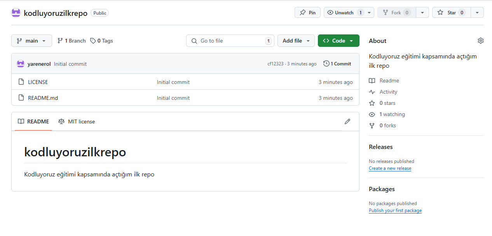

# Kodluyoruz İlk Repo

Bu repo, Kodluyoruz Front-End eğitimi kapsamında oluşturduğum ilk repo. İçinde bir adet **index.html** dosyası ve bir adet **REDME.md** dosyası yer alıyor.



## Installation
Öncelikle bu bağlantıdan projeyi clonelayın: (https://github.com/yarenerol/kodluyoruzilkrepo.git)

````
git clone https://github.com/yarenerol/kodluyoruzilkrepo.git
````
## Usage
Projeyi cloneladıktan sonra bunu Visual Studio Code'da açın. Linux için;
````
cd kodluyoruzilkrepo
code .
````

## Contributing
Pull requestler kabul edilir. Büyük değişiklikler için lütfen önce neyi değiştirmek istediğinizi tartışmak amacıyla bir konu açınız.

## License
[MIT](https://choosealicense.com/licenses/mit/)
